# 1.Introduction

## 1.1       Stm32g031k8 nucleo pinout

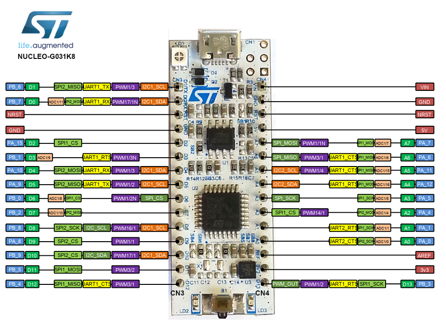

Figure 1:Stm32g031k8 nucleo board pinout

As shown at Figure1, the pins can used for multiple purposes. The only digital pins are
labeled with Dx and pins that can read analog signals with ADC is labeled with Ax.

## 1.2       On board IC’s

    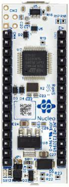

    Figure 2: Stm32g031k8 nucleo board back

The board include a usb port, this port allows code running and debugging using ST- link.
For ST-link a stm32f103 IC is used and is connected to the back of the nucelo
board. The stm32g0 IC operate at 3.3V because of it a 5V 3.3V regulator appear
on the board. A 16Mhz oscillator appear to clock the stm32g0.

## 1.3       Peripherals andtheir usage

### 1.3.1      GPIOs:

GPIOs
(general-purpose input/output) port handles both incoming and outgoing digital
signals. As an input port, it can be used to communicate to the CPU the ON/OFF
signals received from switches, or the digital readings received from
sensors.

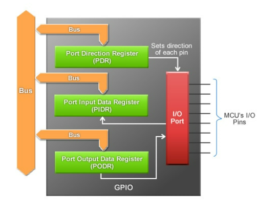

Figure 3: GPIO structure

### 1.3.2      SRAM:

SRAM (static RAM) is a type of random-access memory (RAM) that retains data bits in its memory
if power is being supplied. Unlike dynamic RAM (DRAM), which must be continuously refreshed, SRAM does not
have this requirement, resulting in better performance and lower power usage.

### 1.3.3      FLASH:

The STM32G0 embeds up to 128 Kbytes of single-bank Flash memory. The Flash memory interface manages all
memory access (read, programming and erasing) as well as memory protection,
security and option bytes.

### 1.3.4      DMA:

The direct memory access (DMA) controller is a bus master and system peripheral with single-AHB architecture.
With 5 channels, it performs data transfers between memory-mapped peripherals
and/or memories, to offload the CPU.

### 1.3.5      DMAMUX:

The DMAMUX request multiplexer enables routing DMA
request lines from the peripherals to the DMA controllers in the products.

### 1.3.6      CRC:

The CRC (cyclic redundancy check)
calculation unit is used to get a CRC code using a configurable generator
polynomial value and size, perform data integrity checks of off-/on-chip
memories as a background task without CPU intervention.

### 1.3.7      RNG:

 Provides random numbers which are used when producing an unpredictable result is
desirable.

### 1.3.8      RCC:

The **RCC** peripheral is used to control the internal peripherals,
as well as the reset signals and clock distribution.
The **RCC** gets several internal (**LSI**, **HSI** and **CSI**) and external (**LSE** and **HSE**) clocks. They are used as clock sources for the
hardware blocks, either directly or indirectly

### 1.3.9      USART (universalsynchronous asynchronous receiver transmitter)

The USART is a hardware that enables the device to communicate using serial protocol.

### 1.3.10   ADC:

The analog-to-digital converters allows the microcontroller to accept an analog
value like a sensor output and convert the signal into the digital domain

### 1.3.11   SPI(internal Standard Peripheral Interface):

Provides. simple communication interface allowing the microcontroller. to communicate with
external devices.

### 1.3.12   TIM:

TIM peripheral is a multi-channel timer unit. It’s include
advanced-control timers, general-purpose timers
and basic timers.

### 1.3.13   I2C:

The I2C is a multi-master, multi-slave, synchronous, bidirectional, half-duplex serial
communication bus.

### 1.3.14   RTC:

RTC, is a
digital clock with a primary function to keep accurate track of time even when a power supply is turned off or
a device is placed in low power mode.

### 1.3.15   PLL:

PLL is a clock generation engine in the MCU which is used to generate the clock
speed which is much higher than the internal HSI or external clock

# 2 INTRODUCTION TO PROGRAMMMING Registers (RCC, GPIO)

## 2.1       RCC Configuration I/O port clock enable register (RCC_IOPENR)

The register shown in Figure 1 is defined as
RCC_IOPENR, reset and clock setting is activated by making the related bits 1.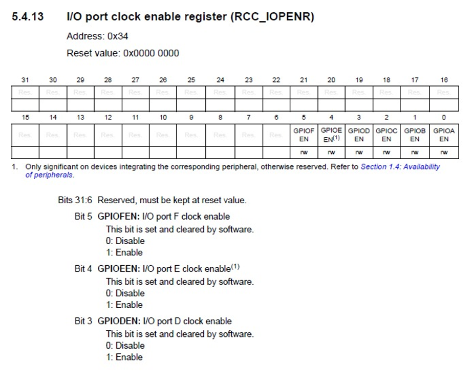

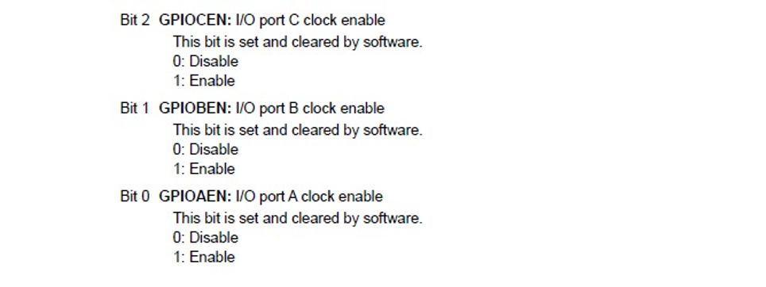

Figure 4: RCC_IOPENR register.

## 2.2 GPIO CONFIGURATIONS

GPIOX base addresses were defined as GPIOX_BASE and
these addresses were accessed to the registers that make the settings on the X
ports. It is seen that there is an offsett of 0x400 between the ports.

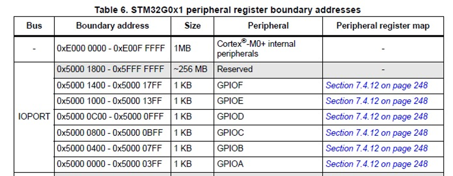

Figure 5: GPIOX address map.

Using GPIOX_BASE addresses, the modes of the pins in
the MODER registry can be set by accessing the MODER registry with offset 0x00.

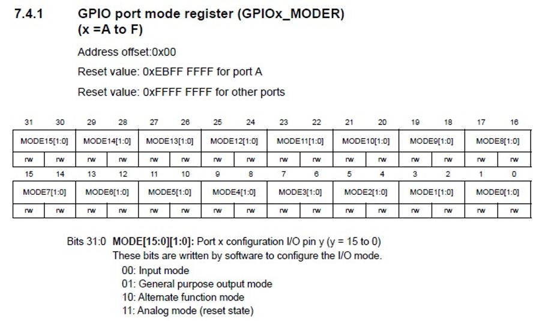

Figure 6: GPIOx_MODER Register

Using GPIOX_BASE addresses, the ODR register is
accessed with 0x14 Offset and the pins are powered by assigning a value of 1 to
the relevant bits in the ODR register.

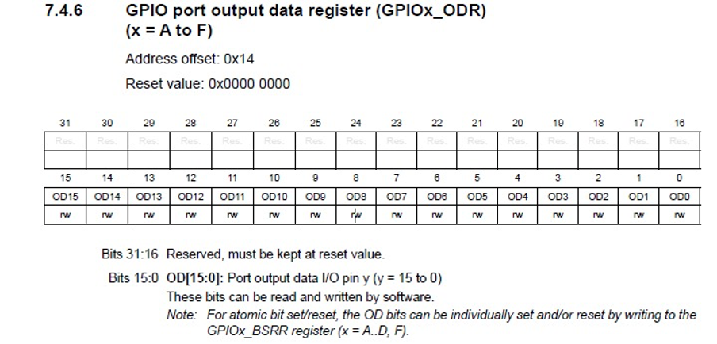

Figure 7: GPIOx_ODR register

# [3 ASSEMBLY_001_led](https://github.com/fouad1233/stm32g0_tutorials/tree/main/ASSEMBLY_001_led "ASSEMBLY_001_led")

To turn on the LED connected to the PA8 pin, the clock of the GPIOA was first activated by set
GPIOAEN bit (bit 0) in RCC_IOPENR register. Then, bits 12-13 were set to 01 in
MODER for PA8 to be output. Finally, the LED was powered by setting OD8 to 1 in
ODR.

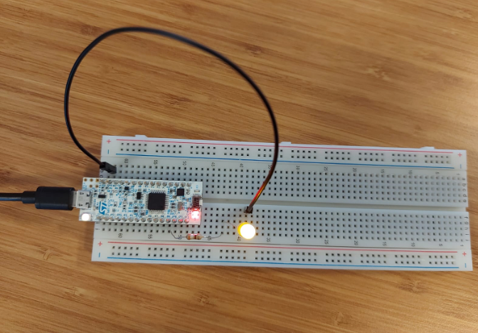

Figure 8: Led on at PA8 pin.

# [4 ASSEMBLY_002_GPIO_functions](https://github.com/fouad1233/stm32g0_tutorials/tree/main/ASSEMBLY_002_GPIO_functions "ASSEMBLY_002_GPIO_functions")

This project includes a multi usage assembly gpio functions. You can take a look to improve yourself and it can be used later.

# [5 ASSEMBLY_003_ledon](https://github.com/fouad1233/stm32g0_tutorials/tree/main/ASSEMBLY_003_ledon "ASSEMBLY_003_ledon")

To turn on the LED connected to the PA11, PA12, PB4,
PB5 pin, the clock setting of GPIOA and GPIOB was first activated. Then, MODE
Pin values were set to 01 in MODER to make the pins output. Finally, the
relevant pins in ODR were set to 1 and the LED was powered.

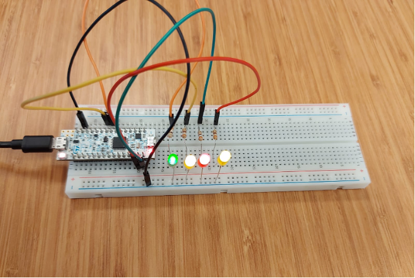

Figure 9: Four led on

# [6 ASSEMBLY_004_ledblink](https://github.com/fouad1233/stm32g0_tutorials/tree/main/ASSEMBLY_004_ledblink "ASSEMBLY_004_ledblink")

## 6.1       Clock settings

In the beginning, the main function configures the microcontroller by enabling the
clock for GPIOA (RCC_IOPENR register). To do this GPIOAEN is set to 1.

## 6.2       GPIO (PA8) configuration

The pin PA8 is set to output mode by using GPIOA_MODER register. To do this the Mode 8 bits
is set to 01.

## 6.3       Toggling led and delay loop

Following the configuration, the ***blink_loop*** is initiated.This loop toggles the state of the LED on pin
PA8 by reading the current state from the Output Data Register (GPIOA_ODR),
XORing it with a mask that represents the state of the LED and storing the
result back to the ODR. This effectively toggles the LED. The mask is 0x100, it
makes only the bit 8 (OD8 bit) toggle and don’t effect to other bits.

After toggling the LED state, the program
introduces a delay by executing a simple countdown loop (delay_loop). The **DELAY_FREQ**
constant determines the duration of the delay, adjusting the speed of the LED
blinking.** DELAY_FREQ **is loaded to r0 and subtract one with ***subs ***instruction,
reference to Cortex-M0 Technical Reference Manual (figure 10) it will
take one cycle than with ***bne*** instruction if r0 not equal to 0
they will go again to the countdown loop (delay_loop), reference to Cortex-M0
Technical Reference Manual it will take three cycle . The loop continues
until the countdown reaches zero. Then go again to blink_loop label and toggle
the led. So the delay_loop function execution time is 4 cycle (1 from subs, and
3 from ben). Assume the Clock is 16Mhz so 16M cycle appear in 1 second, so for
waiting for 1 second we have to do a process of 16M cycle, for do this we made
the loop count for 4M times, that’s make 16M cycle. The code with  **DELAY_FREQ** = 4Mhz was tried, and a clock was kept, the result of the observation was
that the LED was delayed by less than 1 second, faster than expected.
Therefore, dividing the frequency by 3 was tried and the code was run. When
done this way, it was observed that the delay was 1 second. Although we cannot
fully explain the reason for this, it seems that it may be because the loop
execution time is just 3 cycles.

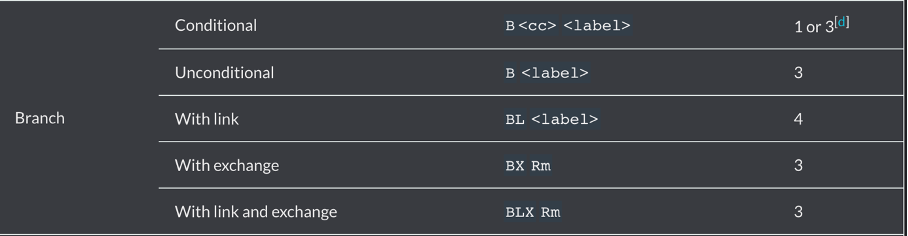

Figure 10: Time of instructions Cortex-M0 Technical Reference Manual
