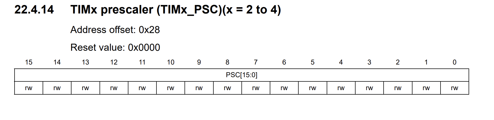

Hi, and welcome to our repo. This repo is prepared for educational purposes. I hope it will be useful and give you an opportunity to learn something and improve yourself. So let's Start!!!!!!!

# 1.Introduction

## 1.1       Stm32g031k8 nucleo pinout

Figure 1:Stm32g031k8 nucleo board pinout

As shown at Figure1, the pins can used for multiple purposes. The only digital pins are
labeled with Dx and pins that can read analog signals with ADC is labeled with Ax.

## 1.2       On board IC’s

   

    Figure 2: Stm32g031k8 nucleo board back

The board include a usb port, this port allows code running and debugging using ST- link.
For ST-link a stm32f103 IC is used and is connected to the back of the nucelo
board. The stm32g0 IC operate at 3.3V because of it a 5V 3.3V regulator appear
on the board. A 16Mhz oscillator appear to clock the stm32g0.

## 1.3       Peripherals andtheir usage

### 1.3.1      GPIOs:

GPIOs
(general-purpose input/output) port handles both incoming and outgoing digital
signals. As an input port, it can be used to communicate to the CPU the ON/OFF
signals received from switches, or the digital readings received from
sensors.

Figure 3: GPIO structure

### 1.3.2      SRAM:

SRAM (static RAM) is a type of random-access memory (RAM) that retains data bits in its memory
if power is being supplied. Unlike dynamic RAM (DRAM), which must be continuously refreshed, SRAM does not
have this requirement, resulting in better performance and lower power usage.

### 1.3.3      FLASH:

The STM32G0 embeds up to 128 Kbytes of single-bank Flash memory. The Flash memory interface manages all
memory access (read, programming and erasing) as well as memory protection,
security and option bytes.

### 1.3.4      DMA:

The direct memory access (DMA) controller is a bus master and system peripheral with single-AHB architecture.
With 5 channels, it performs data transfers between memory-mapped peripherals
and/or memories, to offload the CPU.

### 1.3.5      DMAMUX:

The DMAMUX request multiplexer enables routing DMA
request lines from the peripherals to the DMA controllers in the products.

### 1.3.6      CRC:

The CRC (cyclic redundancy check)
calculation unit is used to get a CRC code using a configurable generator
polynomial value and size, perform data integrity checks of off-/on-chip
memories as a background task without CPU intervention.

### 1.3.7      RNG:

 Provides random numbers which are used when producing an unpredictable result is
desirable.

### 1.3.8      RCC:

The **RCC** peripheral is used to control the internal peripherals,
as well as the reset signals and clock distribution.
The **RCC** gets several internal (**LSI**, **HSI** and **CSI**) and external (**LSE** and **HSE**) clocks. They are used as clock sources for the
hardware blocks, either directly or indirectly

### 1.3.9      USART (universalsynchronous asynchronous receiver transmitter)

The USART is a hardware that enables the device to communicate using serial protocol.

### 1.3.10   ADC:

The analog-to-digital converters allows the microcontroller to accept an analog
value like a sensor output and convert the signal into the digital domain

### 1.3.11   SPI(internal Standard Peripheral Interface):

Provides. simple communication interface allowing the microcontroller. to communicate with
external devices.

### 1.3.12   TIM:

TIM peripheral is a multi-channel timer unit. It’s include
advanced-control timers, general-purpose timers
and basic timers.

### 1.3.13   I2C:

The I2C is a multi-master, multi-slave, synchronous, bidirectional, half-duplex serial
communication bus.

### 1.3.14   RTC:

RTC, is a
digital clock with a primary function to keep accurate track of time even when a power supply is turned off or
a device is placed in low power mode.

### 1.3.15   PLL:

PLL is a clock generation engine in the MCU which is used to generate the clock
speed which is much higher than the internal HSI or external clock

# 2 INTRODUCTION TO PROGRAMMMING Registers (RCC, GPIO)

## 2.1       RCC Configuration I/O port clock enable register (RCC_IOPENR)

The register shown in Figure 1 is defined as
RCC_IOPENR, reset and clock setting is activated by making the related bits 1.

Figure 4: RCC_IOPENR register.

## 2.2 GPIO CONFIGURATIONS

### 2.2.1 Peripherals addresses

GPIOX base addresses were defined as GPIOX_BASE and
these addresses were accessed to the registers that make the settings on the X
ports. It is seen that there is an offsett of 0x400 between the ports.

Figure 5: GPIOX address map.

### 2.2.2 GPIO MODER REGISTER

Using GPIOX_BASE addresses, the modes of the pins in
the MODER registry can be set by accessing the MODER registry with offset 0x00.

Figure 6: GPIOx_MODER Register

### 2.2.3 GPIO ODR REGISTER

Using GPIOX_BASE addresses, the ODR register is
accessed with 0x14 Offset and the pins are powered by assigning a value of 1 to
the relevant bits in the ODR register.

Figure 7: GPIOx_ODR register

### 2.2.4 GPIO IDR REGISTER

Using GPIOX_BASE addresses, the IDR register is accessed with 0x10 Offset and the pins state can read by read this register.

Figure 8: GPIOx_IDR register

# [3 ASSEMBLY_001_led](https://github.com/fouad1233/stm32g0_tutorials/tree/main/ASSEMBLY_001_led "ASSEMBLY_001_led")

To turn on the LED connected to the PA8 pin, the clock of the GPIOA was first activated by set
GPIOAEN bit (bit 0) in RCC_IOPENR register. Then, bits 12-13 were set to 01 in
MODER for PA8 to be output. Finally, the LED was powered by setting OD8 to 1 in
ODR.

Figure 9: Led on at PA8 pin.

# [4 ASSEMBLY_002_GPIO_functions](https://github.com/fouad1233/stm32g0_tutorials/tree/main/ASSEMBLY_002_GPIO_functions "ASSEMBLY_002_GPIO_functions")

This project includes a multi usage assembly gpio functions. You can take a look to improve yourself and it can be used later.

# [5 ASSEMBLY_003_ledon](https://github.com/fouad1233/stm32g0_tutorials/tree/main/ASSEMBLY_003_ledon "ASSEMBLY_003_ledon")

To turn on the LED connected to the PA11, PA12, PB4,
PB5 pin, the clock setting of GPIOA and GPIOB was first activated. Then, MODE
Pin values were set to 01 in MODER to make the pins output. Finally, the
relevant pins in ODR were set to 1 and the LED was powered.

Figure 10: Four led on

# [6 ASSEMBLY_004_ledblink](https://github.com/fouad1233/stm32g0_tutorials/tree/main/ASSEMBLY_004_ledblink "ASSEMBLY_004_ledblink")

## 6.1       Clock settings

In the beginning, the main function configures the microcontroller by enabling the
clock for GPIOA (RCC_IOPENR register). To do this GPIOAEN is set to 1.

## 6.2       GPIO (PA8) configuration

The pin PA8 is set to output mode by using GPIOA_MODER register. To do this the Mode 8 bits
is set to 01.

## 6.3       Toggling led and delay loop

Following the configuration, the ***blink_loop*** is initiated.This loop toggles the state of the LED on pin
PA8 by reading the current state from the Output Data Register (GPIOA_ODR),
XORing it with a mask that represents the state of the LED and storing the
result back to the ODR. This effectively toggles the LED. The mask is 0x100, it
makes only the bit 8 (OD8 bit) toggle and don’t effect to other bits.

After toggling the LED state, the program
introduces a delay by executing a simple countdown loop (delay_loop). The **DELAY_FREQ**
constant determines the duration of the delay, adjusting the speed of the LED
blinking.** DELAY_FREQ **is loaded to r0 and subtract one with ***subs ***instruction,
reference to Cortex-M0 Technical Reference Manual (figure 10) it will
take one cycle than with ***bne*** instruction if r0 not equal to 0
they will go again to the countdown loop (delay_loop), reference to Cortex-M0
Technical Reference Manual it will take three cycle . The loop continues
until the countdown reaches zero. Then go again to blink_loop label and toggle
the led. So the delay_loop function execution time is 4 cycle (1 from subs, and
3 from ben). Assume the Clock is 16Mhz so 16M cycle appear in 1 second, so for
waiting for 1 second we have to do a process of 16M cycle, for do this we made
the loop count for 4M times, that’s make 16M cycle. The code with  **DELAY_FREQ** = 4Mhz was tried, and a clock was kept, the result of the observation was
that the LED was delayed by less than 1 second, faster than expected.
Therefore, dividing the frequency by 3 was tried and the code was run. When
done this way, it was observed that the delay was 1 second. Although we cannot
fully explain the reason for this, it seems that it may be because the loop
execution time is just 3 cycles.

Figure 11: Time of instructions Cortex-M0 Technical Reference Manual

# [7 ](https://github.com/fouad1233/stm32g0_tutorials/tree/main/ASSEMBLY_004_ledblink "ASSEMBLY_004_ledblink")[ASSEMBLY_006_onbordled_blink](https://github.com/fouad1233/stm32g0_tutorials/tree/main/ASSEMBLY_006_onbordled_blink "ASSEMBLY_006_onbordled_blink")

The onboard led is connected to PC6 pin.
The led is blinking by set the pin high and low with 1s intervals.

## 7.1 Flowchart

Figure 12: flowchart of [ASSEMBLY_006_onbordled_blink](https://github.com/fouad1233/stm32g0_tutorials/tree/main/ASSEMBLY_006_onbordled_blink "ASSEMBLY_006_onbordled_blink")

# [8 ASSEMBLY_007_onboardled_on_with_button](https://github.com/fouad1233/stm32g0_tutorials/tree/main/ASSEMBLY_007_onboardled_on_with_button "ASSEMBLY_007_onboardled_on_with_button")

A button is connected to PA0 pin with pull down mode. When the button is pressed,
the input PA0 pin becomes 1 and the LED connected to the PC6 pin on the board
lights up. When the button is not pressed, the PA0 pin becomes 0 and the LED
connected to the PC6 pin on the board does not light.

## 8.1 Schematic

Figure 13: Schematic of [ASSEMBLY_007_onboardled_on_with_button](https://github.com/fouad1233/stm32g0_tutorials/tree/main/ASSEMBLY_007_onboardled_on_with_button "ASSEMBLY_007_onboardled_on_with_button")

## 8.2 Flowchart

Figure 14: Flowchart of [ASSEMBLY_007_onboardled_on_with_button](https://github.com/fouad1233/stm32g0_tutorials/tree/main/ASSEMBLY_007_onboardled_on_with_button "ASSEMBLY_007_onboardled_on_with_button")

# [9 ASSEMBLY_008_8led_blink](https://github.com/fouad1233/stm32g0_tutorials/tree/main/ASSEMBLY_008_8led_blink "ASSEMBLY_008_8led_blink")

The 8 pins of the B port were set to output mode and connected to the LEDs. LEDs were switched on and off with 1 second intervals.

## 9.1 Schematic

Figure 15: Schematic of [ASSEMBLY_008_8led_blink](https://github.com/fouad1233/stm32g0_tutorials/tree/main/ASSEMBLY_008_8led_blink "ASSEMBLY_008_8led_blink")

## 9.2 Flowchart

Figure 16: Flowchart of [ASSEMBLY_008_8led_blink](https://github.com/fouad1233/stm32g0_tutorials/tree/main/ASSEMBLY_008_8led_blink "ASSEMBLY_008_8led_blink")

# [10 ASSEMBLY_009_led_rotate](https://github.com/fouad1233/stm32g0_tutorials/tree/main/ASSEMBLY_009_led_rotate "ASSEMBLY_009_led_rotate")

A button is connected to PA8 with pull down mode and the leds is connected to
port B starting from PB0 to PB7. First starting from LED0, LED3 was switched on
with 100 ms intervals. Then a shift pattern is set 0000 0111 for 8 bit as
initial condition, 1 for leds on and 0 for off. Because registers are 32 bit we
will do the pattern as 0000 0111 0000 0111 0000 0111 0000 0111.Than using
rotate instruction, the shifting pattern is implemented. When the button pressed
the shifting pattern change.

## 10.1 Schematic

Figure 17: Schematic of [ASSEMBLY_009_led_rotate](https://github.com/fouad1233/stm32g0_tutorials/tree/main/ASSEMBLY_009_led_rotate "ASSEMBLY_009_led_rotate")

## 10.2 Flowchart

Figure 18: Flowchart of [ASSEMBLY_009_led_rotate](https://github.com/fouad1233/stm32g0_tutorials/tree/main/ASSEMBLY_009_led_rotate "ASSEMBLY_009_led_rotate")

# [11 ASSEMBLY_010_knight_rider](https://github.com/fouad1233/stm32g0_tutorials/tree/main/ASSEMBLY_010_knight_rider "ASSEMBLY_010_knight_rider")

Leds was connected to the pins of port B. Firstly, starting from LED0, LED3 was
switched on with 100ms intervals. Then the led numbers were shifted to the
right with 100ms intervals. With the algorithm created, when LED8 was reached,
it was shifted towards LED0, and when LED0 was reached, it was shifted towards
LED8.

## 11.1 Schematic

Figure 19: Schematic of [ASSEMBLY_010_knight_rider](https://github.com/fouad1233/stm32g0_tutorials/tree/main/ASSEMBLY_010_knight_rider "ASSEMBLY_010_knight_rider")

## 11.2 Flowchart

Figure 20: Flowchart of [ASSEMBLY_010_knight_rider](https://github.com/fouad1233/stm32g0_tutorials/tree/main/ASSEMBLY_010_knight_rider "ASSEMBLY_010_knight_rider")

# [12 REGC_001_ledblink_systick](https://github.com/fouad1233/stm32g0_tutorials/tree/main/REGC_001_ledblink_systick "REGC_001_ledblink_systick")

As a software method we can record SysTick values before and after delay. Hence the difference between
these values can be calculated. An oscilloscope can be used as a hardware method. Calculating the time difference between the toggled signal frequency at the start and end of the delay. -oscilloscope used for measure the frequencies-

## 12.1 Flowchart

Figure 21: Flowchart of [REGC_001_ledblink_systick](https://github.com/fouad1233/stm32g0_tutorials/tree/main/REGC_001_ledblink_systick "REGC_001_ledblink_systick")

## 12.2 Some important registers

> I cant find it in the stm32g0 referance manuel or datacheet so i tahe these photoes from stm32f4 datasheet.

Figure 22: Reload register

Figure 23: Current value register

Figure 24: Systick Control and Status Register

# [13 REGC_002_timer_interrupt](https://github.com/fouad1233/stm32g0_tutorials/tree/main/REGC_002_timer_interrupt "REGC_002_timer_interrupt")

The TIM2 timer interrupt is used to
change the state of the LED by tracking the time. The EXTI interrupt is used to
increase or decrease the blinking rate of the LED when a button is pressed. As
a result, it realizes an application that uses timer and external interrupts to
control the LED to blink at a specific speed.

## 13.1 Flowchart

Figure 25: Flowchart of [REGC_002_timer_interrupt](https://github.com/fouad1233/stm32g0_tutorials/tree/main/REGC_002_timer_interrupt "REGC_002_timer_interrupt")

## 13.2 Schematic

Figure 26: Schematic of [REGC_002_timer_interrupt](https://github.com/fouad1233/stm32g0_tutorials/tree/main/REGC_002_timer_interrupt "REGC_002_timer_interrupt")

## 13.3 Important registers

### 13.3.1 TIM2 registers

Figure 27: Control register 1 of TIMx

This register is used in the code to enablle or disable timer.To understand the usage you can take a look to **Start_TIM2(void)** function.

Figure 28: TIMx Prescaler register

Figure 28: TIMx Counter register (CNT)

Figure 29: TIMx auto reload register

Figure 29: TIMx Interrupt enable register (DIER)

It is used to update interrupt enable.

### 13.3.2 EXTI registers

#### EXTI->EXTICR[1]

Figure 30: Extenal interrupt control register (EXTICR)

* **EXTICR (External Interrupt Configuration Register)** : This register is used to select the GPIO port that is connected to the EXTI line. The STM32 microcontrollers have multiple EXTICR registers (EXTICR1, EXTICR2, etc.), each controlling a group of EXTI lines.
* **`EXTI_EXTICR1_EXTI0_0`** : This specific bit setting in the `EXTICR[1]` register connects EXTI line 0 to GPIO port A. The notation `[1]` seems to be a mistake here since EXTI0 configuration should be in `EXTICR[0]` (assuming EXTICR registers are zero-indexed in your environment). The correct approach to connect EXTI1 to GPIOA Pin 0 would typically involve `EXTICR[0]` and setting the appropriate bits for GPIOA.

#### EXTI->RTSR1

Figure 31: Extenal interrupt rising trigger selection register (EXTI_RTSR1)

* **RTSR1 (Rising Trigger Selection Register 1)** : This register is used to enable rising edge triggers on the EXTI lines. Setting a bit in this register selects the corresponding EXTI line to be sensitive to rising edges.
* **`EXTI_RTSR1_RT0`** : Setting this bit enables EXTI line 0 to trigger an interrupt request on a rising edge.

#### EXTI->FTSR1

Figure 32: Extenal interrupt falling trigger selection register (EXTI_FTSR1)

* **FTSR1 (Falling Trigger Selection Register 1)** : Similar to RTSR1, but for falling edge triggers.
* **`EXTI_FTSR1_FT0`** : Clearing this bit (`&= ~EXTI_FTSR1_FT0`) ensures that EXTI line 0 will not trigger an interrupt request on a falling edge, making it sensitive to rising edges onlyEXTI->IMR1
* **IMR1 (Interrupt Mask Register 1)** : This register is used to enable or disable interrupt requests from the EXTI lines.
* **`EXTI_IMR1_IM0`** : Setting this bit enables interrupt requests from EXTI line 0. This means that when the selected edge (rising, in this case) is detected on EXTI line 0, an interrupt request will be generated.

## 13.4 Frequency Calculation

* **PSC (Prescaler Register)** : This register determines the division factor applied to the timer's clock. By slowing down the clock, the timer can count at a slower rate, allowing for longer intervals.
* **CNT (Counter Register)** : Acts as the core of the timer, incrementing on each clock cycle. When it reaches the value in the ARR, an event can be triggered.
* **ARR (Auto-Reload Register)** : Specifies the value to which the CNT register resets after reaching its maximum count. This defines the period of the timer's cycle.

The frequency of the timer can be calculated using the formula:

`Frequency = Clock / ((PSC + 1) * (ARR ))`.

Adjusting the PSC and ARR values allows for fine-tuning of the timer's frequency for various applications.

The clock i 16 Mhz for this application.

# [14 REGC_003_seven_segment](https://github.com/fouad1233/stm32g0_tutorials/tree/main/REGC_003_seven_segment "REGC_003_seven_segment")

In this problem, pushbutton control
was provided on the seven segment display using external interrupts. When the
button is pressed, the led on and the display starts to increase starting from
0, when it reaches 999, it stops and the led off. If the button is pressed
again during the process, the display will reset and start over.

## 14.1 Flowchart

Figure 33: Flowchart of [REGC_003_seven_segment](https://github.com/fouad1233/stm32g0_tutorials/tree/main/REGC_003_seven_segment "REGC_003_seven_segment")

## 14.2 Schematic

Figure 34: Schematic of [REGC_003_seven_segment](https://github.com/fouad1233/stm32g0_tutorials/tree/main/REGC_003_seven_segment "REGC_003_seven_segment")

# [15 REGC_004_ledblink_watchdog](https://github.com/fouad1233/stm32g0_tutorials/tree/main/REGC_004_ledblink_watchdog "REGC_004_ledblink_watchdog")

For the independent watchdog timer,
the time is set according to the following parameters and the blinking of the
led is tested. If the set time is exceeded and the watchdog is not refreshed,
the system will be reset.

## 15.1 Important registers

Figure 35: IWDG key Register (IWDG_KR)

Figure 36: IWDG Prescaler Register (IWDG_PR)

Figure 37: IWDG Reload Register (IWDG_RLR)

## 15.2 Independent Watchdog time calculation

Figure 38: time calculation

## 15.3 Flowchart

Figure 39: flowchart of [REGC_004_ledblink_watchdog](https://github.com/fouad1233/stm32g0_tutorials/tree/main/REGC_004_ledblink_watchdog "REGC_004_ledblink_watchdog")

# [16 REGC_005_seven_segment_with_watchdog](https://github.com/fouad1233/stm32g0_tutorials/tree/main/REGC_005_seven_segment_with_watchdog "REGC_005_seven_segment_with_watchdog")

The system was tested by adding watchdog timer while working as in [REGC_003_seven_segment](https://github.com/fouad1233/stm32g0_tutorials/tree/main/REGC_003_seven_segment "REGC_003_seven_segment") . If the watchdog timer time is made 16 s and watchdog refresh is not done within this time, the screen is reset and starts counting from the beginning.

## 16.1 Flowchart

Figure 40: flowchart of [REGC_005_seven_segment_with_watchdog](https://github.com/fouad1233/stm32g0_tutorials/tree/main/REGC_005_seven_segment_with_watchdog "REGC_005_seven_segment_with_watchdog")

## 16.2 Schematic

Figure 41: Schematic of [REGC_005_seven_segment_with_watchdog](https://github.com/fouad1233/stm32g0_tutorials/tree/main/REGC_005_seven_segment_with_watchdog "REGC_005_seven_segment_with_watchdog")

# [17 REGC_006_uart](https://github.com/fouad1233/stm32g0_tutorials/tree/main/REGC_006_uart "REGC_006_uart")

The aim of this project is creating the functions of transmitting and receiving data.

   When we observe the code, first GPIOA,
USART2 module clocks and PA2, PA3 pins are enabled from RCC. Then PA2 and PA3
pins settled as alternate function for the USART2 module. CR1 control register
choose from datasheet at enabling receive and transmit from USART2 module. TDR
and RDR registers used at data transmit and receive processes respectively.
Baud rate settled to 9600 bps assuming clock is running at 16Mhz. Value chosen
according to the formula of baud rate and EISA RS-232 communication Standard.

Baud Rate = APBxCLK
/ USARTx

    Some of the standard baud rates: 300, 600,
1200, 2400, 4800, 9600, 14400, 19200, 38400, 57600, 115200, 230400, 460800.

## 17.1 Flowchart

Figure 42: Flowchart of [REGC_006_uart](https://github.com/fouad1233/stm32g0_tutorials/tree/main/REGC_006_uart "REGC_006_uart")

# [18 REGC_007_pwm](https://github.com/fouad1233/stm32g0_tutorials/tree/main/REGC_007_pwm "REGC_007_pwm")

Pulse Width Modulation is a technique used to encode information in the duration of a pulse
signal. By changing the duty cycle of the PWM signal LED brightness can be
changed.

Figure 43: Duty cycle led brightness relationship

PWM involves rapidly toggling a digital signal between
high and low states. The frequency of the PWM signal can calculated by the
above formula:

Figure 44: PWM frequency formula

To set the PWM frequency to 1 Khz, because the clock is
default 16Mhz, PSC register value is set as 15, and ARR register value as 1000.
To set the duty cycle the CCR register value can changed. The duty cycle
percentage can be calculated by the above formula:

Figure 44: PWM Duty cycle formula

So as an example, to set duty cycle to 40% CCR value must
be equal to 400. 

TIM2 is used to generate the PWM signal, and the
interrupt is activated. In the interrupt the duty cycle of the PWM signal is
updated. By using the Systick timer a counter is increased and decreased. The
counter is set as PWM duty cycle in the TIM2 interrupt. So, every 1ms the
counter increase by 1, this is equal to 0.1% of duty cycle.

## 18.1 Flowchart

Figure 45: Flowchart of [REGC_007_pwm](https://github.com/fouad1233/stm32g0_tutorials/tree/main/REGC_007_pwm "REGC_007_pwm")

## 18.2 Schematic

Figure 46: Schematic of [REGC_007_pwm](https://github.com/fouad1233/stm32g0_tutorials/tree/main/REGC_007_pwm "REGC_007_pwm")
